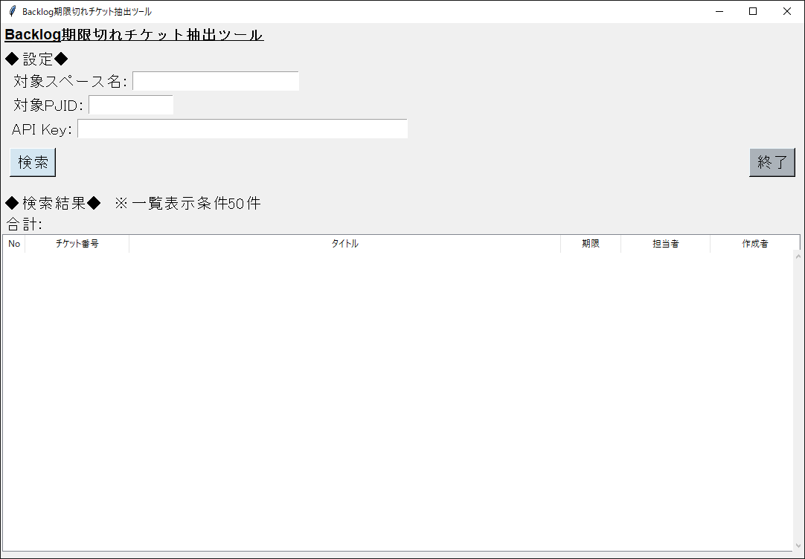

# backlog_list : Backlog期限切れチケット抽出ツール

このツールは、BacklogAPIを用いて実行した日付までが対応期限となっているチケットの一覧を取得するものです。
認証方式は、API Keyを利用しています。

## なぜこのツールを作ったのか
- Pythonで何か作ってみたかった
- Backlogに都度都度ログインするのが面倒になってきた
- BacklogAPIを使ってみたかった
- Pythonの勉強のため
- テキスト出力で作ってみたけど、ディレクトリ移動とか面倒だった
- サーバがない状態でも動作できるようにしたくてGUIツールにしたかった
- 楽をして仕事をやっている感じを出したかったから
- 基本的にはPython3の標準ライブラリを利用してみたかった

## 開発・動作環境
- Windows 10 64bit
    - Macでは、TKinterのバグのようでボタンの文字列が表示されなかったため
- Python 3.8.3
    - vevnでPythonの仮想環境を構築
    - Pythonはscoopを用いてインストール
- Python Package
    - pip 20.1.1 \backlog_list\.venv\lib\site-packages\pip (python 3.8)
    - pylint 2.5.3
    - requests 2.23.0
- VSCode
    - jebbs.plantuml
    - ms-python.python
    - shd101wyy.markdown-preview-enhanced
- graphviz 2.38
    - Markdown/PlantUML利用のため
- oraclejdk 14.0.1-7
    - Markdown/PlantUML/graphviz利用のため

## 使い方
### 仕様しているAPI
- [課題数の取得](https://developer.nulab.com/ja/docs/backlog/api/2/count-issue/#%E8%AA%B2%E9%A1%8C%E6%95%B0%E3%81%AE%E5%8F%96%E5%BE%97)
- [課題一覧の取得](https://developer.nulab.com/ja/docs/backlog/api/2/get-issue-list/#%E8%AA%B2%E9%A1%8C%E4%B8%80%E8%A6%A7%E3%81%AE%E5%8F%96%E5%BE%97)

### このツールの使い方
- このツールを利用する際に必要な下記の情報を、Backlogのサイトにログインし、取得する
    - スペース名（URL）
    - プロジェクトID
    - API Key
- 仮想環境をアクティベートする
    ```
    .\.venv\Scripts\activate
    ```
- モジュール指定の形式でアプリケーションを起動する
    ```
    python -m classes.application
    ```
- 検索ボタンを押下する
    - 設定項目で、入力状態をチェックする
    - 全て入力されていれば下記の処理を実施する
        - 入力項目を設定ファイルとして保存する（次回起動時に読み込む）
        - APIを呼び出す
- 終了ボタンを押下して終了する（入力内容の保存はせずに終了する）

### 画面


## 参考サイト
### Backlog API
- 公式サイト
    - [Backlog API とは | Backlog Developer API | Nulab](https://developer.nulab.com/ja/docs/backlog/)
- 使い方紹介サイト
    - [Backlog APIを使ってみた - Qiita @mako2kano](https://qiita.com/mako2kano/items/fd4c6c397b2d8db4f862)


### Python Tkinter
- フレームとラベルフレーム　配置とグループ化
    - [お気楽 Python/Tkinter 入門 - フレーム](http://www.nct9.ne.jp/m_hiroi/light/pytk05.html)

- Widgetの配置と余白設定
    - [Tkinter 入門: 2. Widget を配置しよう](https://www.shido.info/py/tkinter2.html)

- フォントの設定：オプション設定によるフォント一括設定
    - [Python/Tkinter プログラミング　講座 フォントの指定](http://bacspot.dip.jp/virtual_link/www/si.musashi-tech.ac.jp/www/Python_IntroTkinter/01/index-4.html)

- 表の作成：TreeView
    - [表（テーブル）の作成【python tkinter sqlite3で家計簿を作る】 - memopy](http://memopy.hatenadiary.jp/entry/2017/06/02/230723)
    - [【Python GUI tkinter実用サンプル】ttk.Treeviewを使ってをSQLiteのDBを閲覧編集するSQLiteビューワーを作成する | エンジニアになりたいブログ](https://suzutaka-programming.com/tkinter-ttk-sqliteviewer-sample/)

- jsonファイルの取り扱い
    - [PythonでJSONファイル・文字列の読み込み・書き込み | note.nkmk.me](https://note.nkmk.me/python-json-load-dump/)

- Tkinterの色々なサンプルサイト
    - [Py In My Eye: July 2012](https://pyinmyeye.blogspot.com/2012/07/)
        - [Py In My Eye: Tkinter Labelframe Demo](https://pyinmyeye.blogspot.com/2012/07/tkinter-labelframe-demo.html)

